# Git Tide: Automated tag and branch management with semantic versioning

`tide` streamlines developer workflows and ensures best-practices through branch, tag, and release automation.

## Features

### Two **branching modes**: 

- [`gitflow`](#gitflow-mode) (the default) — a ladder of long-lived branches, with rungs for development, release-candidate, and stable release.  A promotion event triggers a series of merges that cascade changes into the next most stable rung.  Hotfixes land on the stable branch and cascade the opposite direction.
- [`semantic_commit`](#semantic-commit-mode) — trunk-based, where the conventional commit messages determine each version

Both of these branching models are streamlined variants of the widely popularized approaches.

### Monorepo support

Projects within a single repository are independently versioned. A project is a folder with a `pyproject.toml` file. `tide autotag` tags only the projects whose files changed.

### Automatic semantic versioning

No need to manually bump the version in a file, `tide` determines the version through tag history during release.  This avoids the need to explicitly commit the version change, which adds immense flexibility in developer workflows: merge requests can be reordered and merge conflicts are avoided.

## Gitflow mode

Overview:
- Automatic cascading merging of hotfixes from stable branches into experimental ones, e.g. alpha, beta, rc (this is the "ebb tide")
- Automated "promotion" of experimental branches forward to their next branch.  e.g. alpha to beta, beta to rc, and so on. (this is the "flood tide" or "flow")

### Example flow

The diagrams below shows two release cycles. Each diagram adds a phase to the diagram before it.

> NOTE: this document and this repository use **develop**, **staging**, and **main** as
> their gitflow branches. Set your own branch names in the **pyproject.toml** and
> **.gitlab-ci.yml** files.

**1. Starting state: `v1.0.0` is released, and work begins on 1.1**

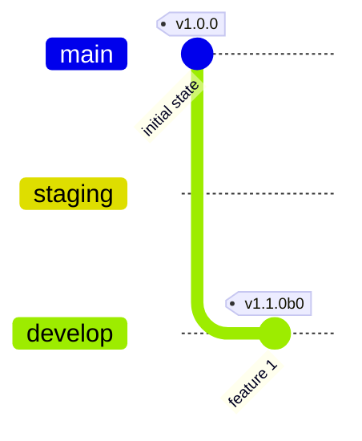
A new feature arrives on `develop`, which starts the `1.1` version line, with `v1.1.0b0`.

> Note: On pre-release branches only the pre-release suffix (`rc`, `b`, `a`) is incremented and not the patch version: e.g. `v1.1.0rc0` → `v1.1.0rc1`.  
> That is because this is the version that will _become_ `v1.1.0` when it is finally released, after two promotions. This is faithful to the semantic versioning spec. 

**2. Promotion**

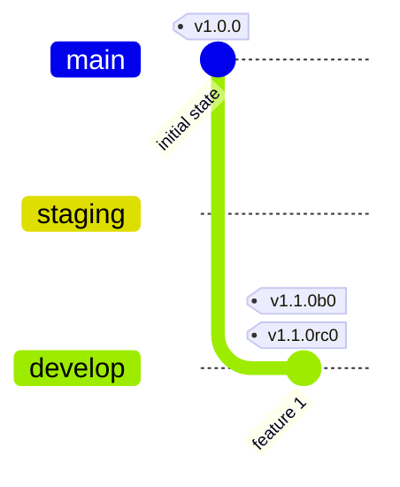

`tide promote` merges `develop` to `staging` and creates tag `v1.1.0rc0`.  For now `develop` and `staging` are the same.

> Note: Typically, the existing `staging` branch would be released to `main` during a promotion, but in this case, this is the moment when `staging` is first introduced.

**3. Work begins on 1.2**

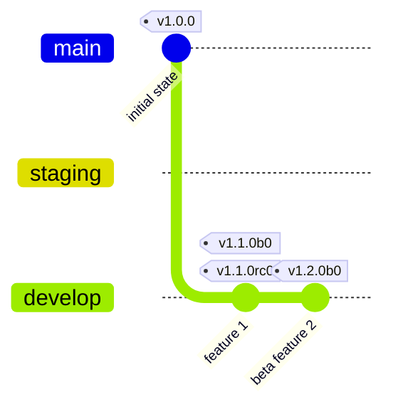

A new feature is added to `develop` which starts the `1.2` version line.

**4. Hotfix to main**

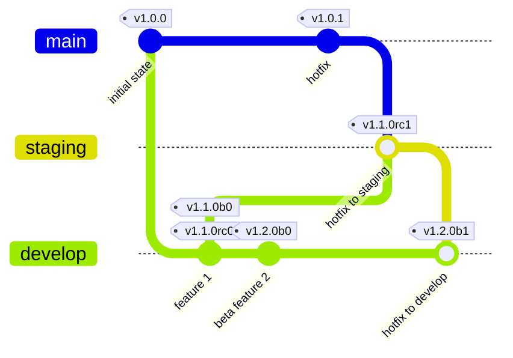

A hotfix is merged to `main` which adds `v1.0.1` there. 
`tide hotfix` then cascades the hotfix up the ladder, first to `staging`, then to `develop`.

**5. Hotfix to staging**

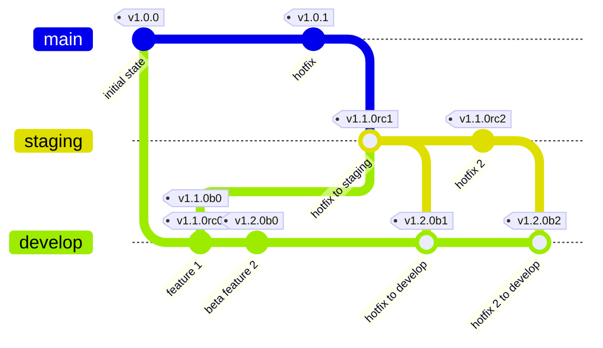

A bug is found on `staging`, so a hotfix is introduced there. `tide hotfix` cascades the change from `staging` to `develop`.

**6. Promotion and release**

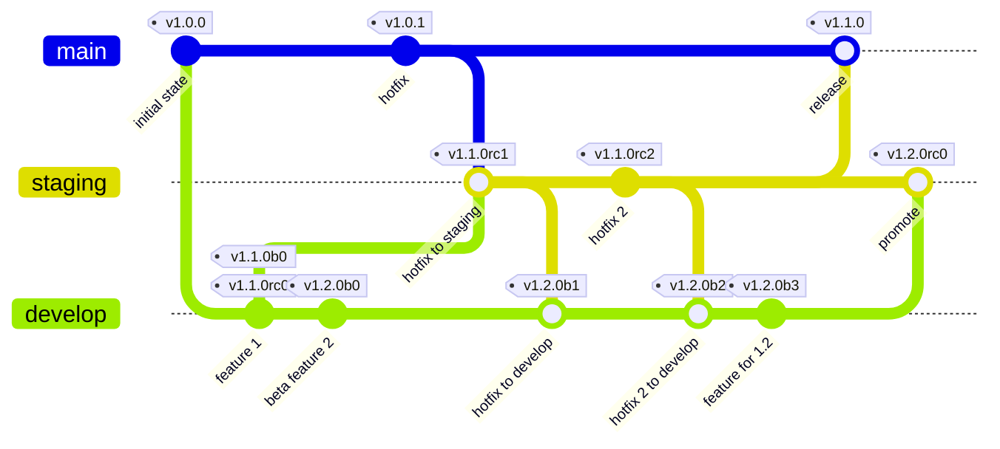

`tide promote` completes the release of the `1.1` line by merging `staging` to `main`, and then promotes the `1.2` line from `develop` to `staging`.

## Semantic commit mode

Set `branching_mode = "semantic_commit"` to use a trunk-based model instead of the
gitflow ladder. This mode has no promotion and no hotfix cascade. The
[conventional commit](https://www.conventionalcommits.org/) types of the commits that
touched a project since its last tag decide its next version.

```toml
[tool.tide]
branching_mode = "semantic_commit"
branches.stable = "main"
```

Set only `branches.stable`. It specifies the **trunk**, the one branch that receives all
development. `branches.alpha`, `branches.beta`, and `branches.rc` are errors in this
mode.

### Release branches

When the minor or the major version of a project changes, `tide` opens a new
**version line**. It also creates a **release branch** that owns the line, e.g.
`release-1.1`. 

> Note: You can specify the branch formatting with `release_branch_format`.

While the trunk owns a line, add your patches on the trunk. `tide` then fast-forwards
the release branch to follow. One atomic push moves the tag and the branch together, so
the two can never disagree.

A merge request that targets a release branch makes that branch **diverge** from the
trunk. Ownership of the version line then transfers to the release branch, and the trunk can no
longer add a patch version on that line. An attempt to do so produces an error that explains both
remedies: retarget the change at the release branch, or change the commit type to
`feat:` to open a new version line.

A release branch accepts only patch changes, and only to the project that owns the
branch.

### How a version line moves

**1. The starting state: 1.0**

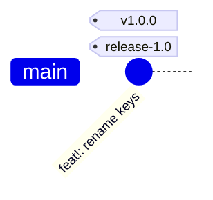

The trunk (`main`) owns the `1.0` version line.  The `release-1.0` branch coincides with `main`.

> Note: A label such as `release-1.0` marks the commit that the release _branch_ points at. 
> It looks like a tag, but it's meant to show a branch that coincides with `main`.

**2. Bump the minor version to 1.1, and fix**

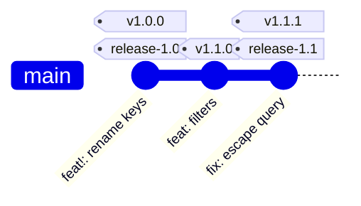

`feat: filters` bumps the minor version, so `tide` creates branch `release-1.1`. `fix: escape query` then lands on the trunk and tags `v1.1.1`, and `tide` fast-forwards the release branch to follow.

**3. Backport the fix to the 1.0 line**

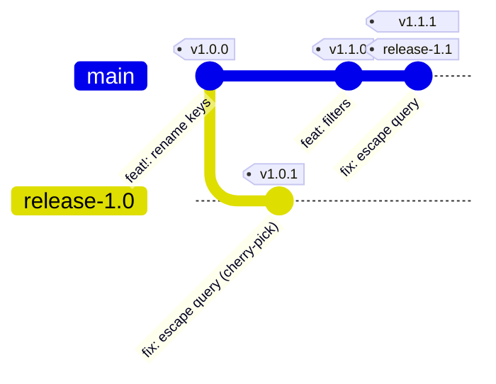

It is determined that `fix: escape query` needs to be backported to the `1.0` line, so a merge request is created targeting `release-1.0` and eventually merged.
The result is that branch diverges from the trunk and takes ownership of the `1.0` line. 
The trunk can no longer mint a version on the `1.0` line. A patch on the trunk that lands on a line owned by a divergent release branch  is an error, and `tide` rejects it.

> Note: `tide` never merges a release branch back into the trunk, so the fix is a cherry-pick. A
cherry-pick copies the change into a new commit.

**4. Bump the minor version to 1.2**

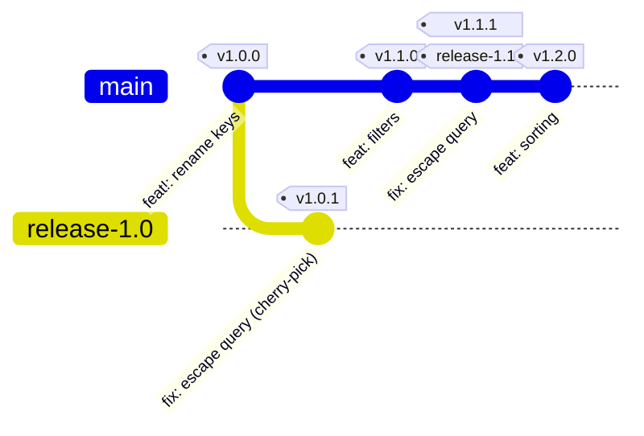

`feat: sorting` lands on the trunk and creates `release-1.2`.
Since this branch still coincides with `main` new fixes to this line should continue to target `main`.

**5. Add a fix to the 1.1 line**

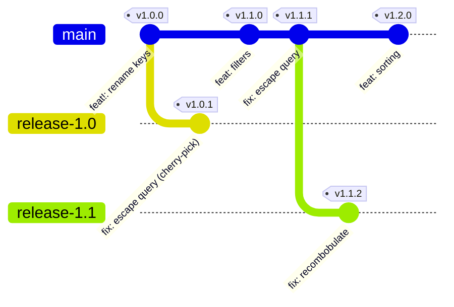

Finally, to demonstrate the recurring pattern, a fix is added to `release-1.1` which causes it to diverge from the trunk.

### Validating merge requests

`autotag` runs only on release pipelines, so use `tide validate` to apply the same
rules to a merge request before it lands:

```bash
tide validate --target-branch "$CI_MERGE_REQUEST_TARGET_BRANCH_NAME"
```

`tide validate` exits non-zero with a distinct code for each rule. 
Your CI configuration decides whether the failure blocks the pipeline. 
For example, run the job with `allow_failure: true` in Gitlab to make it advisory.
`autotag` runs the same checks again on the commits that landed, so `autotag`
remains the authoritative check even when CI skips the merge request job or allows it
to fail.

Use `.gitlab-ci-semantic.yml` as the starting point for this mode.

## Setting up a repo

`tide` needs the Gitlab repo to be configured as follows:

- Add a `[tool.tide]` section to your `pyproject.toml` file. It defines the gitflow branch names and the pre-release versions that you want to use.
    ```toml
    [tool.tide]
    branches.beta = "develop"
    branches.rc = "staging"
    branches.stable = "main"
    ```
- Add a `project` entry for each project in your repo that needs tagged releases:
    ```toml
    [tool.tide]
    project = "project_name"
    ```
  If the repo contains one project, put all of your options under a single `[tool.tide]` section.
- Optionally override the tag format and the release branch format. Both formats
  contain the project by default, so that two projects never share a namespace:
    ```toml
    [tool.tide]
    tag_format = "$project/$version"                       # e.g. 1.1.0
    release_branch_format = "$project/release-$major.$minor"  # e.g. release-1.1
    ```

  > **Upgrading from tide 0.x:** these defaults changed in 1.0.0. The old default for
  > `tag_format` was `"$version"`, which put every project of a monorepo into one
  > shared tag namespace. To keep your existing tags, set the old default yourself:
  >
  > ```toml
  > [tool.tide]
  > tag_format = "$version"
  > ```
- Create a [Project Access Token](https://docs.gitlab.com/ee/user/project/settings/project_access_tokens.html). Give it the scope to push tags, to push changes, and to create CI/CD variables.
- Run `tide init --access-token='YOUR_ACCESS_TOKEN'`
- Copy the `.gitlab-ci.yml` file and edit it. The branch variables must match the ones in the `pyproject.toml` file. (TODO: generate `.gitlab-ci.yml` in `tide init`)

## Development

### Setting up your local development environment

- Clone the repository with https or ssh, then run the following commands:
```bash
python -m venv venv
.\venv\Scripts\Activate
pip install -r requirements.txt
pre-commit install
```

### Local development info, tips, and tricks

`nox` is the primary interface for the day to day tasks.

Use `nox --list` to see the tasks that are available.

### Running the unit tests

```bash
nox -s unit_tests
```

You can run the primary test `tests/test_unit.py::test_dev_cycle` in three modes:
- local: simulates the cycle with local repos
- remote: tests the integration against real gitlab repos
- gitlab-ci-local: simulates the cycle with local repos, but reads the entry point and the environment variables from the `.gitlab-ci.yml` file. You must install https://github.com/firecow/gitlab-ci-local

Run it in remote mode as follows:
```bash
EXEC_MODE="remote" ACCESS_TOKEN="your-access-token-here" nox -s unit_tests -- tests/test_unit.py::test_dev_cycle -vv -s
```

Run it with `gitlab-ci-local` as follows:
```bash
EXEC_MODE="gitlab-ci-local" nox -s unit_tests -- tests/test_unit.py::test_dev_cycle -vv -s
```

### Serving Documentation on GitLab Pages

GitLab Pages hosts the documentation that MkDocs generates. The whole repository shares
one documentation site.

#### How it works

- **One documentation set:** the repository has a single documentation site that covers
  every project in it.
- **Automated builds:** the CI pipeline rebuilds the site on each change, so the
  published site matches the current code.
